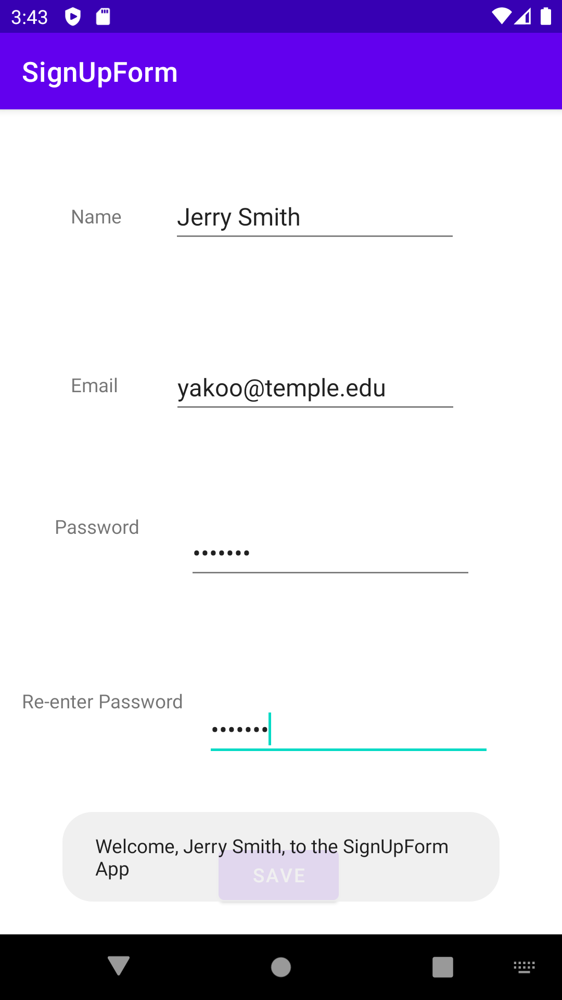

# SignUpForm
Assignment 2 
This program is a sign up for where users enter their name, email address, and password
The program checks each textbox for validation. Empty strings and strings containing only whitespaces are rejected with specific error messages for each field.
If all checks are passed, a Toast message welcomes the user.
Screenshot included.

